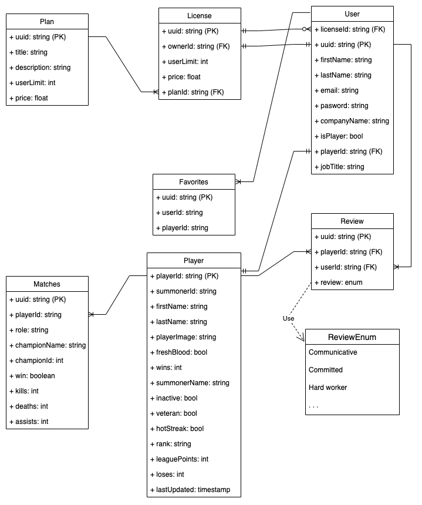

  
   
  Project 2 - Team Supernova
   
   

Hiring a Pro Player is tricky as a number of factors count when selecting a new hire. To solve that Supernova is creating a data-oriented platform to deliver the right information needed to select new Pro Players.

## Tech Stack

- React
- NodeJS
- MongoDB
- TypeScript
- Railway
- Netlify

## System Design
## Data Model

[Data Model - Drawio](https://viewer.diagrams.net/?tags=%7B%7D&highlight=0000ff&layers=1&nav=1&title=Data%20Model.drawio#Uhttps%3A%2F%2Fdrive.google.com%2Fuc%3Fid%3D1Ya5dM1KsiaGQj-9y51ZdKQr-oiOwTntX%26export%3Ddownload)